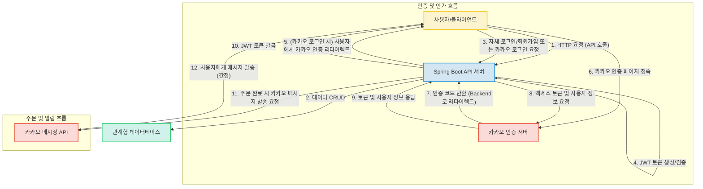

# spring-gift 프로젝트

안녕하세요! `spring-gift` 프로젝트는 Spring Boot 기반의 RESTful API 백엔드 서비스입니다. 온라인 선물하기 서비스의 핵심 기능을 구현하는 데 초점을 맞추었으며, 사용자 인증(자체 JWT, 카카오 OAuth2), 상품 관리, 주문 처리, 그리고 카카오 메시징을 통한 주문 알림 등의 기능을 제공합니다. 이 프로젝트는 백엔드 개발 역량을 보여주기 위한 포트폴리오 목적으로 적합하게 설계되었습니다.

## 주요 기능

*   **상품 관리**: 상품의 생성, 조회, 수정, 삭제(CRUD) 기능을 RESTful API로 제공하며, 상품 이름 유효성 검증 로직을 포함합니다.
*   **회원 인증**: 이메일/비밀번호 기반의 일반 회원 가입 및 로그인 기능을 제공하며, JWT(JSON Web Token)를 활용한 자체 인증 시스템을 구축합니다.
*   **소셜 로그인**: 카카오 OAuth 2.0 연동을 통해 사용자 친화적인 소셜 로그인 경험을 제공하고, 카카오 계정을 이용한 회원 가입 및 로그인을 지원합니다.
*   **주문 처리**: 상품 주문 기능을 제공하며, 주문 시 재고 및 사용자 포인트 차감, 주문 내역 관리 등의 복합적인 비즈니스 로직을 수행합니다.
*   **카카오톡 알림**: 주문 완료 시 카카오 메시징 API를 통해 사용자에게 주문 완료 알림 메시지를 발송합니다.
*   **데이터베이스 관리**: Flyway를 활용하여 데이터베이스 스키마를 체계적으로 관리하고 변경 이력을 추적하여 개발 및 배포의 안정성을 높입니다.

## 프로젝트 구조

본 프로젝트는 Spring Boot의 표준 디렉토리 구조를 따르며, 주요 기능별로 패키지를 분리하여 모듈성을 높였습니다.

```
.
├── src
│   ├── main
│   │   ├── java
│   │   │   └── gift                // 메인 애플리케이션 및 핵심 비즈니스 로직 패키지
│   │   │       ├── Application.java // Spring Boot 애플리케이션 시작점
│   │   │       ├── auth            // 인증 및 인가 관련 로직 (JWT, Kakao OAuth)
│   │   │       ├── member          // 회원 관련 로직
│   │   │       ├── order           // 주문 관련 로직 (Kakao 메시징 클라이언트 포함)
│   │   │       └── product         // 상품 관련 로직 (엔티티, 컨트롤러 등)
│   │   └── resources
│   │       ├── application.properties // 애플리케이션 환경 설정 파일 (JWT secret, Kakao Client ID 등)
│   │       ├── db
│   │       │   └── migration      // Flyway DB 마이그레이션 스크립트
│   │       └── templates          // (추정) 서버 사이드 렌더링용 HTML 템플릿
│   └── test
│       └── java                  // 테스트 코드
└── build.gradle.kts              // Gradle 빌드 설정 파일 (Kotlin DSL)
```

**참고**: 디렉토리 구조에 대한 상세 정보가 없어 핵심 파일들을 기준으로 유추하여 작성되었습니다.

## 핵심 파일 설명

프로젝트의 핵심 파일과 그 역할은 다음과 같습니다:

*   **`src/main/java/gift/Application.java`**: Spring Boot 애플리케이션의 시작점입니다. `@SpringBootApplication`을 통해 자동 구성 및 컴포넌트 스캔을 활성화합니다.
*   **`src/main/java/gift/auth/JwtProvider.java`**: JWT 토큰의 생성 및 유효성 검증을 담당합니다. 사용자의 이메일을 기반으로 JWT를 발급하고, 토큰에서 이메일을 추출하는 기능을 제공하여 서비스의 인증 시스템의 핵심 역할을 수행합니다.
*   **`src/main/java/gift/auth/KakaoAuthController.java`**: 카카오 OAuth 2.0 로그인 흐름을 전반적으로 처리하는 컨트롤러입니다. 사용자를 카카오 인증 페이지로 리다이렉션하고, 콜백으로 받은 인가 코드를 통해 카카오 액세스 토큰 및 사용자 정보를 획득하여 회원 가입/로그인 및 서비스 JWT 발급을 담당합니다.
*   **`src/main/java/gift/product/ProductController.java`**: 상품 관련 REST API 엔드포인트(CRUD: 생성, 조회, 수정, 삭제)를 정의합니다. 상품 목록 조회, 상세 조회, 생성, 수정, 삭제 기능을 제공하며, 상품 이름 유효성 검증 로직을 포함합니다.
*   **`src/main/java/gift/order/OrderController.java`**: 주문 관련 REST API 엔드포인트를 처리하는 컨트롤러입니다. 사용자 인증 후 주문 생성 및 조회 기능을 제공하며, 재고 차감, 포인트 차감, 카카오 메시지 발송 등의 복합적인 비즈니스 로직을 수행합니다.
*   **`src/main/java/gift/member/MemberController.java`**: 일반 회원 가입 및 이메일/비밀번호 기반 로그인 REST API 엔드포인트를 담당하는 컨트롤러입니다. 회원 정보를 저장하고, 로그인 성공 시 JWT를 발급합니다.
*   **`src/main/java/gift/product/Product.java`**: `Product` 엔티티 클래스입니다. 상품의 ID, 이름, 가격, 이미지 URL, 소속 카테고리, 그리고 상품에 포함될 수 있는 옵션 목록을 정의하며, JPA `@Entity`로 데이터베이스 테이블과 매핑됩니다.
*   **`src/main/java/gift/order/Order.java`**: `Order` 엔티티 클래스입니다. 주문 정보를 나타내며, 어떤 옵션에 대해 어떤 회원이 몇 개의 수량을 어떤 메시지와 함께 주문했는지, 주문 시간은 언제인지를 기록합니다.
*   **`src/main/java/gift/member/Member.java`**: `Member` 엔티티 클래스입니다. 사용자의 ID, 이메일, 비밀번호, 카카오 액세스 토큰, 그리고 보유 포인트를 관리합니다. 회원 정보 업데이트 및 포인트 충전/차감 로직을 포함합니다.
*   **`src/main/java/gift/order/KakaoMessageClient.java`**: 카카오톡 메시지 API를 사용하여 사용자에게 주문 완료 알림 메시지를 보내는 클라이언트입니다. 특정 형식의 메시지 템플릿을 빌드하여 카카오 API로 전송하는 역할을 합니다.
*   **`src/main/resources/application.properties`**: 애플리케이션의 설정 파일로, JWT secret 및 만료 시간, 카카오 클라이언트 ID 등 환경 관련 설정과 민감 정보를 관리합니다.
*   **`src/main/resources/db/migration/V1__Initialize_project_tables.sql`**: 데이터베이스 초기 스키마를 정의하는 SQL 스크립트입니다. 애플리케이션 구동 시 필요한 테이블을 생성합니다. (Flyway 또는 유사한 마이그레이션 도구를 사용한 것으로 추정)

## 기술 스택

### Frontend
*   **기본 HTML/CSS (추정)**: 복잡하지 않은 관리 페이지나 정보성 페이지를 서버에서 직접 렌더링하여 빠른 개발과 SEO 이점을 얻을 수 있을 것으로 추정됩니다.

### Backend
*   **Java**: 성숙하고 안정적인 생태계를 활용하여 신뢰성 있는 백엔드 서비스를 구축합니다.
*   **Spring Boot**: 빠른 개발 및 쉬운 배포를 통해 생산성을 극대화하고 마이크로서비스 아키텍처 구현에 용이합니다.
*   **Spring Web (REST API)**: 표준화된 HTTP 기반 RESTful API를 쉽게 구축하여 다양한 클라이언트와의 통합을 용이하게 합니다.
*   **Spring Data JPA / Hibernate**: 객체-관계 매핑(ORM)을 통해 데이터베이스 작업을 간소화하고 비즈니스 로직에 집중할 수 있도록 돕습니다.
*   **JJWT (JSON Web Token)**: 안전하고 효율적인 방식으로 사용자 인증 및 권한 부여를 위한 JSON Web Token을 생성하고 검증할 수 있습니다.
*   **Jakarta Bean Validation**: 선언적인 방식으로 객체의 유효성 검사를 자동화하여 코드의 가독성과 유지보수성을 높입니다.
*   **Spring RestClient**: 현대적인 비동기 HTTP 클라이언트를 사용하여 외부 API와의 통신을 간결하고 효율적으로 처리합니다.
*   **카카오 OAuth2 연동**: 널리 사용되는 외부 인증 서비스를 통합하여 사용자 경험을 확장하고 보안을 강화할 수 있습니다.
*   **카카오 메시징 API 연동**: 주문 완료 알림 등 메시징 기능을 통해 사용자에게 실시간 정보를 제공하고 서비스 활용도를 높입니다.

### Database
*   **관계형 데이터베이스 (SQL)**: 정형화된 데이터를 효율적으로 저장하고 관리하며, 트랜잭션의 안정성과 데이터 무결성을 보장합니다.

### DevOps
*   **Gradle (Kotlin DSL)**: 유연하고 강력한 빌드 시스템을 통해 프로젝트 의존성 관리 및 빌드 자동화를 효율적으로 수행합니다.
*   **Flyway (DB 마이그레이션)**: 데이터베이스 스키마 변경 이력을 체계적으로 관리하여 개발 및 배포 과정의 안정성을 높입니다.

## 시스템 아키텍처

본 프로젝트는 Java와 Spring Boot를 기반으로 하는 RESTful API 백엔드 서비스입니다. 사용자는 클라이언트(웹/모바일)를 통해 API 서버에 요청을 보내며, API 서버는 데이터베이스에 데이터를 저장하고 관리합니다. 특히, 사용자 인증 시에는 자체 JWT 인증 시스템 또는 카카오 인증 서버를 통한 OAuth2 연동을 지원합니다. 주문이 완료되면 카카오 메시징 API를 통해 사용자에게 알림을 발송하는 기능을 포함합니다.



## 실행 방법

추가 작성 필요

## 기술 선택 이유

*   **Java & Spring Boot**: 성숙하고 안정적인 생태계를 바탕으로 신뢰성 있는 백엔드 서비스를 구축하며, 빠른 개발과 쉬운 배포를 통해 생산성을 극대화하기 위해 선택했습니다.
*   **Spring Web (REST API)**: 표준화된 HTTP 기반 RESTful API를 쉽게 구축하여 다양한 클라이언트(웹, 모바일)와의 통합을 용이하게 합니다.
*   **Spring Data JPA / Hibernate**: 객체-관계 매핑(ORM)을 통해 데이터베이스 작업을 간소화하고 비즈니스 로직 개발에 집중할 수 있도록 돕습니다.
*   **JJWT (JSON Web Token)**: 안전하고 효율적인 방식으로 사용자 인증 및 권한 부여를 위한 JWT를 생성하고 검증하여 보안성을 확보합니다.
*   **Jakarta Bean Validation**: 선언적인 방식으로 객체의 유효성 검사를 자동화하여 코드의 가독성과 유지보수성을 높입니다.
*   **Spring RestClient**: 현대적인 비동기 HTTP 클라이언트를 사용하여 외부 API (카카오)와의 통신을 간결하고 효율적으로 처리하여 통합 개발을 용이하게 합니다.
*   **카카오 OAuth2 연동 & 카카오 메시징 API 연동**: 널리 사용되는 외부 인증 서비스를 통합하여 사용자 경험을 확장하고, 메시징 기능을 통해 실시간 정보를 제공하여 서비스 활용도를 높입니다.
*   **관계형 데이터베이스 (SQL)**: 정형화된 데이터를 효율적으로 저장하고 관리하며, 트랜잭션의 안정성과 데이터 무결성을 보장하는 데 강점이 있습니다.
*   **Gradle (Kotlin DSL)**: 유연하고 강력한 빌드 시스템을 통해 프로젝트 의존성 관리 및 빌드 자동화를 효율적으로 수행합니다.
*   **Flyway (DB 마이그레이션)**: 데이터베이스 스키마 변경 이력을 체계적으로 관리하여 개발 및 배포 과정의 안정성을 높입니다.

## 개선 방향

본 프로젝트는 다음과 같은 방향으로 개선될 수 있습니다.

*   **데이터베이스 마이그레이션 도구 명확화**: Flyway 사용에 대한 명시적인 설정을 `build.gradle.kts`에 추가하고 의존성을 확실히 하여, 데이터베이스 스키마 관리의 투명성을 높일 수 있습니다.
*   **관리자 기능 상세 구현 및 권한 분리**: `AdminMemberController`, `AdminProductController`의 구체적인 기능을 구현하고, Spring Security 등을 활용하여 일반 사용자와의 명확한 권한 분리 및 보안을 강화할 수 있습니다.
*   **서버 사이드 렌더링 (SSR) 활용 명확화**: `src/main/resources/templates/` 디렉토리 내 HTML 파일들의 활용 방안(예: Thymeleaf를 통한 관리자 페이지 렌더링)을 구체화하고 코드에 반영할 수 있습니다.
*   **`AuthenticationResolver`의 상세 구현**: JWT 검증 및 Member 객체 추출 로직을 명확히 정의하고 문서화하여 인증 시스템의 투명성을 높일 수 있습니다.
*   **주문 시 동시성 처리 로직 구현**: 재고 차감 및 포인트 차감 시 발생할 수 있는 동시성 이슈를 해결하기 위해 낙관적 락, 비관적 락, 또는 분산 락과 같은 적절한 동시성 제어 메커니즘을 적용할 수 있습니다.
*   **Kotlin 코드 활용 여부 결정**: `src/main/kotlin` 디렉토리가 존재하는 경우, Kotlin 언어의 이점을 활용할 명확한 계획을 수립하거나, 현재 사용되지 않는다면 불필요한 디렉토리를 제거하여 프로젝트를 간결하게 유지하는 것이 좋습니다.
*   **위시리스트 정리 로직 명확화**: 주문 완료 후 위시리스트에서 해당 상품을 정리하는 로직을 `wishRepository`를 사용하여 명시적으로 구현하고 테스트하여 비즈니스 흐름의 완성도를 높일 수 있습니다.
*   **예외 처리 및 로깅 강화**: 전역 예외 처리 메커니즘을 더욱 견고하게 구축하고, 적절한 로깅 전략을 적용하여 운영 환경에서의 문제 진단 및 해결을 용이하게 할 수 있습니다.