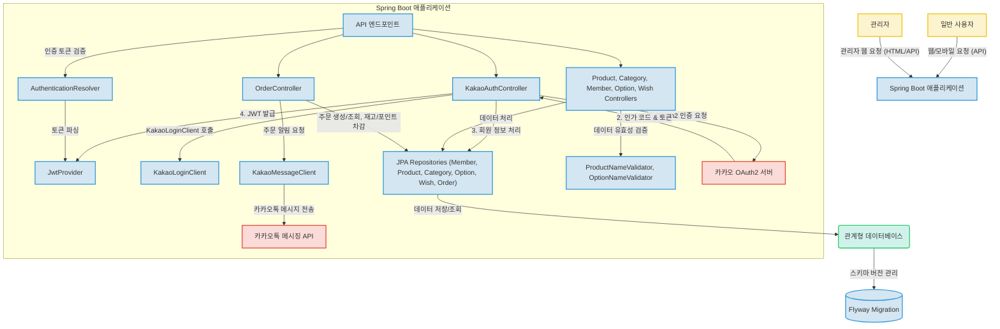

# Unknown Project

이 프로젝트는 Spring Boot 3.x 기반으로 개발된 선물 주문 및 관리 백엔드 애플리케이션입니다. 사용자 인증은 카카오 OAuth2 및 JWT를 통해 처리하며, 회원, 상품, 카테고리, 옵션, 위시리스트, 주문 등의 핵심 비즈니스 로직을 RESTful API 형태로 제공합니다. 주문 완료 시 카카오톡 메시징 API를 통해 사용자에게 알림을 전송하는 외부 연동 기능이 구현되어 있습니다.

## 프로젝트 소개

`Unknown Project`는 선물 관련 서비스를 지원하는 백엔드 시스템으로 추정됩니다. 최신 Spring Boot 프레임워크를 활용하여 안정적이고 확장 가능한 서비스를 구축하는 것을 목표로 하며, 카카오 소셜 로그인, JWT 기반 인증, 상품 및 주문 관리, 그리고 카카오톡 알림 발송 기능을 통합합니다. 프로젝트의 전체적인 목적과 설계 의도는 문서화가 부족하여 코드를 통해 추정되었습니다.

## 주요 기능

*   **카카오 OAuth2 소셜 로그인**: 카카오 계정을 통한 간편한 회원가입 및 로그인 지원.
*   **JWT 기반 인증 시스템**: 안전하고 표준화된 방식으로 사용자 인증 및 권한 관리.
*   **상품 관리**: 상품 정보(ID, 이름, 가격, 이미지 URL, 카테고리, 옵션) 생성, 조회, 수정, 삭제(CRUD) REST API 제공.
*   **회원 관리**: 회원 정보(ID, 이메일, 포인트 등) 관리 및 포인트 충전/차감 로직 포함.
*   **주문 관리**: 상품 옵션 재고 확인, 회원 포인트 차감, 주문 정보 저장 등 복합적인 주문 처리 로직 구현.
*   **카카오톡 주문 알림**: 주문 완료 시 카카오톡 메시징 API를 통해 사용자에게 알림 메시지 전송.
*   **관계형 데이터베이스 연동**: JPA를 활용한 객체-관계 매핑으로 데이터 영속성 관리.
*   **데이터베이스 스키마 버전 관리**: Flyway를 이용하여 데이터베이스 변경 이력을 안정적으로 관리.
*   **RESTful API 제공**: 다양한 클라이언트(웹, 모바일)와 연동 가능한 표준화된 API 엔드포인트.

## 프로젝트 구조

프로젝트의 디렉토리 구조에 대한 상세 정보는 제공되지 않았습니다. 하지만 핵심 파일 및 기술 스택 분석을 바탕으로 다음과 같은 논리적인 구조를 추정할 수 있습니다.

*   **`controller`**: REST API 엔드포인트를 정의하고 클라이언트 요청을 처리합니다. 인증, 주문, 상품 등 도메인별 컨트롤러로 구성됩니다. (예: `KakaoAuthController`, `OrderController`, `ProductController`)
*   **`service`**: 비즈니스 로직을 구현하고 트랜잭션을 관리합니다. 컨트롤러와 데이터 접근 계층(Repository) 사이에서 핵심 역할을 수행합니다. (추정)
*   **`repository`**: Spring Data JPA를 활용하여 데이터베이스와의 상호작용을 추상화합니다. 엔티티별로 데이터 접근 인터페이스를 정의합니다.
*   **`entity`**: JPA 엔티티를 정의하여 데이터베이스 테이블과 객체를 매핑합니다. (예: `Member`, `Product`, `Order`)
*   **`config`**: 애플리케이션의 설정 및 빈(Bean) 정의를 담당합니다. (예: 보안 설정, JWT 설정) (추정)
*   **`dto`**: 데이터 전송 객체(Data Transfer Object)로, 클라이언트와 서버 간 데이터 교환에 사용됩니다. (추정)
*   **`client`**: 외부 API(카카오 OAuth2, 카카오톡 메시징) 연동 로직을 담당합니다. (예: `KakaoLoginClient`, `KakaoMessageClient`)
*   **`security`**: JWT 관련 로직, 인증/인가 필터 등을 포함합니다. (예: `JwtProvider`)
*   **`validator`**: 요청 데이터의 유효성을 검증하는 로직을 포함합니다. (추정)
*   **`resources`**: 설정 파일, HTML 템플릿, 정적 파일 등을 포함합니다.

## 핵심 파일 설명

이 프로젝트의 주요 기능을 담당하는 핵심 파일(또는 논리적 컴포넌트)들은 다음과 같습니다.

*   `Unknown`: Spring Boot 애플리케이션의 시작점입니다. `@SpringBootApplication` 어노테이션을 통해 자동 설정 및 컴포넌트 스캔을 수행합니다.
*   `Unknown`: 카카오 OAuth2 로그인 흐름을 전적으로 담당하는 REST 컨트롤러입니다. 인가 코드를 받아 액세스 토큰을 요청하고, 사용자 정보 조회 후 회원 등록 및 JWT 발급까지 처리합니다.
*   `Unknown`: JWT(JSON Web Token)의 생성 및 검증을 담당하는 핵심 컴포넌트입니다. 사용자 이메일을 기반으로 토큰을 발급하고, 유효한 토큰으로부터 사용자 정보를 추출합니다.
*   `Unknown`: 상품 정보를 정의하는 JPA 엔티티입니다. 상품의 ID, 이름, 가격, 이미지 URL, 카테고리, 옵션 리스트 등 핵심 데이터를 포함하며 데이터베이스와 매핑됩니다.
*   `Unknown`: 상품 관련 REST API 엔드포인트(CRUD)를 제공하는 컨트롤러입니다. 상품 목록 조회, 단일 상품 상세 조회, 생성, 수정, 삭제 기능을 수행합니다.
*   `Unknown`: 회원 정보를 정의하는 JPA 엔티티입니다. ID, 이메일, 카카오 액세스 토큰, 포인트 등 사용자 관련 데이터를 관리하며, 포인트 충전 및 차감 로직을 포함합니다.
*   `Unknown`: 주문 생성 및 조회 REST API를 제공하는 컨트롤러입니다. 사용자 인증 확인, 상품 옵션 재고 차감, 회원 포인트 차감, 주문 정보 저장, 카카오 메시지 발송 등의 복합적인 주문 처리 비즈니스 로직을 통합하여 실행합니다.
*   `Unknown`: 카카오톡 메시지 API를 호출하여 사용자에게 주문 완료 알림 메시지를 전송하는 역할을 합니다. 카카오 API 연동 로직과 메시지 템플릿 빌딩 기능을 구현합니다.

## 기술 스택

이 프로젝트는 다음과 같은 기술 스택으로 구성되어 있습니다.

### Frontend
*   **HTML Templates (Thymeleaf 등 추정)**: 서버에서 동적으로 HTML 페이지를 렌더링하여 사용자에게 기본적인 웹 인터페이스를 제공합니다.

### Backend
*   **Java**: 안정성과 확장성이 뛰어나 대규모 엔터프라이즈 시스템 개발에 널리 사용됩니다.
*   **Spring Boot (v3.x 추정)**: 설정의 복잡성을 줄여 빠르고 쉽게 독립 실행형, 프로덕션 등급의 Spring 기반 애플리케이션을 개발할 수 있게 해줍니다.
*   **Spring Web (RESTful API)**: HTTP 기반의 RESTful 웹 서비스를 효율적으로 구축하여 다양한 클라이언트와 통신할 수 있습니다.
*   **Spring Data JPA**: 데이터베이스와의 상호작용을 간소화하여 객체-관계 매핑(ORM)을 통해 생산성을 높입니다.
*   **Gradle (Kotlin DSL)**: 빌드 프로세스를 강력하고 유연하게 자동화하며, Kotlin 언어로 스크립트를 작성하여 가독성과 유지보수성을 높입니다.
*   **JJWT (Java JWT)**: JSON Web Token(JWT)을 안전하게 생성하고 검증하여 API 인증 및 권한 부여를 처리하는 표준화된 방법을 제공합니다.
*   **Spring RestClient**: 최신 Spring Framework에서 제공하는 직관적이고 타입 세이프한 HTTP 클라이언트로, 외부 API 연동을 간결하게 만듭니다.
*   **Jakarta Persistence API (JPA)**: Java 애플리케이션에서 관계형 데이터베이스의 데이터를 객체처럼 다룰 수 있게 해주는 표준 인터페이스입니다.
*   **Jakarta Validation (Bean Validation)**: 데이터 모델의 유효성을 선언적으로 검증하여 애플리케이션의 데이터 무결성을 보장합니다.

### Database
*   **Relational Database (e.g., H2 for dev, PostgreSQL/MySQL for prod)**: 정형화된 데이터를 효율적으로 저장하고 관리하며, 데이터의 일관성과 무결성을 보장합니다.
*   **Flyway**: 데이터베이스 스키마 변경 이력을 관리하고 버전별 마이그레이션을 자동화하여 데이터베이스 진화를 안정적으로 지원합니다.

### DevOps
*   **Git**: 소스 코드의 변경 이력을 효율적으로 추적하고 여러 개발자 간의 협업을 용이하게 합니다.
*   **Gradle Wrapper**: 모든 개발 환경에서 일관된 Gradle 버전을 사용하여 빌드 재현성을 보장하고 환경 설정 문제를 줄여줍니다.
*   **Java Development Kit (JDK 17+ 추정)**: 자바 애플리케이션 개발에 필요한 도구와 런타임 환경을 제공하여, 현대적인 자바 언어 기능을 활용할 수 있게 합니다.

## 시스템 아키텍처

이 프로젝트는 Spring Boot 기반의 선물 주문 및 관리를 위한 백엔드 애플리케이션으로, RESTful API를 통해 다양한 클라이언트와 상호작용합니다. 사용자 인증은 카카오 OAuth2와 JWT를 활용하며, 데이터는 관계형 데이터베이스에 저장됩니다. 주문 완료 시 카카오톡을 통해 사용자에게 알림을 전송하는 외부 연동 기능을 포함합니다.

아래 다이어그램은 시스템의 주요 구성 요소와 데이터 흐름을 시각적으로 나타냅니다.

## 실행 방법

프로젝트 실행 방법에 대한 상세 정보는 현재 제공되지 않습니다.
추가 작성 필요:
1.  **사전 준비**: JDK 설치, Gradle 설치 (또는 Gradle Wrapper 사용), 데이터베이스 설정(로컬 H2 또는 외부 RDB), 카카오 개발자 앱 설정 (REST API 키, Redirect URI 등).
2.  **환경 설정**: `application.yml` 또는 `application-dev.yml` 파일에 데이터베이스 연결 정보, 카카오 API 키, JWT 비밀키 등 환경 변수 설정.
3.  **빌드**: 프로젝트 루트 디렉토리에서 `./gradlew build` 명령을 실행하여 프로젝트를 빌드합니다.
4.  **실행**: 빌드가 완료되면 `./gradlew bootRun` 명령 또는 `./build/libs/*.jar` 파일을 실행하여 애플리케이션을 시작합니다.

## 기술 선택 이유

*   **Java**: 엔터프라이즈 환경에서 검증된 안정성, 강력한 생태계, 높은 성능을 제공하여 복잡한 비즈니스 로직 구현에 적합합니다.
*   **Spring Boot**: 빠른 개발 속도, 쉬운 설정, 내장형 서버 제공으로 독립적인 서비스 배포에 유리하며, 마이크로서비스 아키텍처 구축에도 용이합니다.
*   **Spring Web (RESTful API)**: 표준화된 HTTP 메서드를 사용하여 리소스 기반의 통신을 가능하게 하여, 다양한 클라이언트와의 유연한 통합을 지원합니다.
*   **Spring Data JPA**: JPA 표준을 기반으로 데이터베이스 접근 계층을 추상화하여 개발자가 SQL 작성 없이 객체 지향적으로 데이터를 다룰 수 있게 해 생산성을 향상시킵니다.
*   **Gradle (Kotlin DSL)**: JVM 기반 언어를 위한 유연하고 강력한 빌드 도구이며, Kotlin DSL을 사용하여 빌드 스크립트의 가독성과 유지보수성을 높입니다.
*   **JJWT (Java JWT)**: JWT 표준을 쉽게 구현하고 관리할 수 있도록 도와주어, 안전한 토큰 기반 인증 시스템 구축에 필수적입니다.
*   **Spring RestClient**: Spring Framework 6.1부터 도입된 최신 HTTP 클라이언트로, 간결하고 타입 세이프한 방식으로 외부 REST API 연동 코드를 작성할 수 있게 합니다.
*   **Jakarta Persistence API (JPA)**: Java 애플리케이션에서 ORM(객체-관계 매핑)을 통해 관계형 데이터베이스를 효율적으로 다룰 수 있도록 표준화된 인터페이스를 제공합니다.
*   **Jakarta Validation (Bean Validation)**: 데이터 유효성 검증 로직을 어노테이션 기반으로 선언하여 코드 중복을 줄이고 데이터 무결성을 쉽게 보장합니다.
*   **Relational Database**: 정형화된 데이터의 일관성, 무결성, 안정적인 트랜잭션 처리가 중요한 비즈니스 애플리케이션에 적합합니다.
*   **Flyway**: 데이터베이스 스키마 변경 사항을 버전별로 관리하고 자동 마이그레이션을 지원하여, 협업 환경에서 데이터베이스 진화를 안전하게 수행할 수 있습니다.
*   **Git**: 분산 버전 관리 시스템으로, 여러 개발자 간의 협업을 원활하게 하고 코드 변경 이력을 효율적으로 관리합니다.
*   **Gradle Wrapper**: 프로젝트에 사용되는 Gradle 버전을 고정하여 모든 개발 환경에서 일관된 빌드 결과를 보장하고 환경 설정 오류를 방지합니다.
*   **Java Development Kit (JDK 17+)**: 최신 Java 언어 기능과 성능 최적화를 활용하여 현대적인 애플리케이션을 개발하고 유지보수할 수 있습니다.

## 개선 방향

현재 프로젝트 분석 결과에 따라 다음과 같은 개선 방향을 고려할 수 있습니다.

*   **README.md 상세화**: 프로젝트의 목적, 상세 설계 의도, 아키텍처 다이어그램, 주요 기능 시연 방법 등을 포함하는 `README.md`를 작성하여 프로젝트 이해도를 높여야 합니다.
*   **프론트엔드 역할 명확화 및 문서화 (추정)**: `src/main/resources/templates`에 존재하는 HTML 파일들의 구체적인 용도(예: 관리자 페이지, 서버 사이드 렌더링된 특정 뷰, 에러 페이지)를 명확히 하고 문서화해야 합니다. 독립적인 SPA 프론트엔드가 있다면 연동 방안을 기술해야 합니다.
*   **일반 회원가입/로그인 기능 추가 및 명확화 (추정)**: 카카오 소셜 로그인 외에 일반적인 이메일/비밀번호 기반의 회원가입 및 로그인 기능이 필요한 경우, 이를 구현하고 문서에 명시해야 합니다. 현재는 카카오 로그인 흐름만 확인됩니다.
*   **관리자/사용자 권한 상세 구현 및 문서화 (추정)**: `AdminMemberController` 등의 존재로 관리자 역할이 추정되나, 각 API 엔드포인트별로 구체적인 인증/인가(권한) 정책이 어떻게 적용되는지 상세하게 구현하고 문서화해야 합니다. Spring Security를 활용한 역할 기반 접근 제어(RBAC) 구현을 고려할 수 있습니다.
*   **테스트 코드 작성 (추정)**: `src/test/java` 및 `src/test/kotlin` 디렉토리는 존재하지만, 실제 테스트 코드는 없는 것으로 보입니다. 단위 테스트, 통합 테스트, 인수 테스트 등을 작성하여 코드의 견고성을 확보하고 향후 변경에 대한 안정성을 높여야 합니다.
*   **API 문서화**: Swagger/OpenAPI를 활용하여 REST API 엔드포인트 목록, 요청/응답 형식, 파라미터 등을 자동 문서화하여 클라이언트 개발자들이 쉽게 API를 이해하고 사용할 수 있도록 해야 합니다.
*   **에러 핸들링 전략 구체화**: 일관된 에러 응답 형식 및 글로벌 에러 핸들링 전략을 구체화하여 사용자 경험을 개선하고 디버깅을 용이하게 해야 합니다.
*   **로깅 전략 및 모니터링**: 애플리케이션의 운영 상태를 효과적으로 파악할 수 있도록 로깅 전략을 수립하고, 모니터링 시스템과의 연동을 고려해야 합니다.
*   **환경 변수 관리 개선**: 민감한 정보(API 키, DB 비밀번호 등)를 코드 내에 하드코딩하지 않고, 환경 변수 또는 외부 설정 파일을 통해 안전하게 관리하는 방안을 강화해야 합니다.
*   **성능 최적화**: 대규모 트래픽 발생 시를 대비하여 데이터베이스 쿼리 최적화, 캐싱 전략 도입, 비동기 처리 적용 등 성능 최적화 방안을 검토해야 합니다.