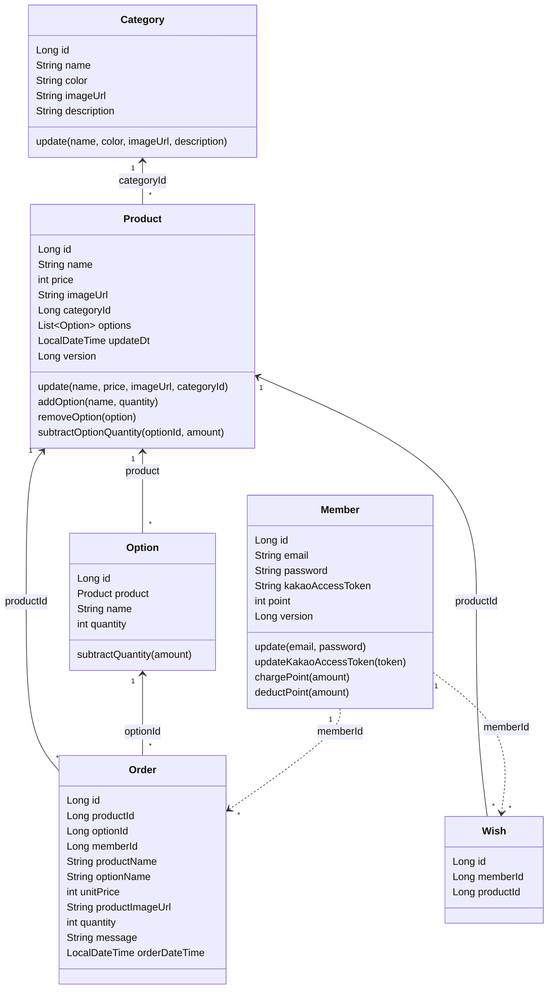
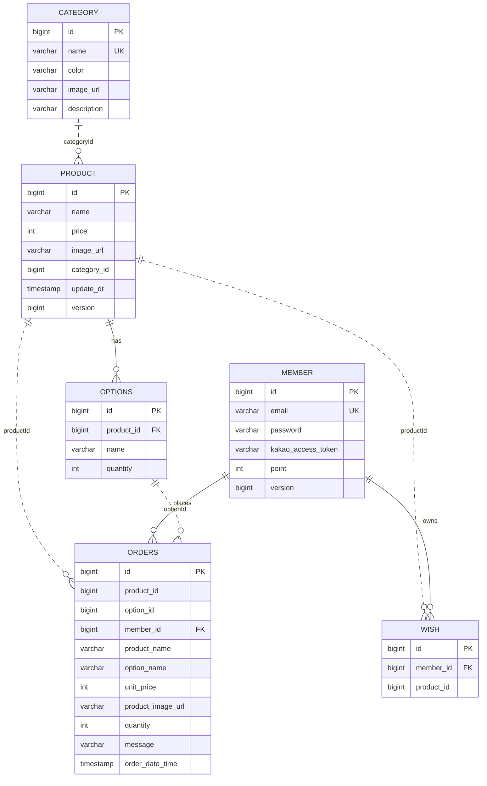

# Object Modeling Current State

이 문서는 현재 코드 기준의 객체 모델과 책임 배치를 정리한다. Category,
Product/Option, Wish, Member 회원가입, Order 생성/목록은 UseCase 서비스로 일부
이동했고, 남은 흐름은 아직 컨트롤러와 리포지토리 조합이 섞여 있다.

## Package Structure

```text
gift
|-- auth       JWT, Kakao OAuth 로그인, 인증 사용자 해석
|-- category   카테고리 controller/domain/service/usecase
|-- product    상품/옵션 controller/entity/dto/repository/service/usecase, 관리자 상품 화면
|-- member     회원 API, 관리자 회원 화면, 회원 엔티티/DTO/리포지토리
|-- wish       위시 controller/domain/service/usecase, 목록 query DAO
|-- order      주문 controller/domain/service/usecase, 목록 query DAO, Kakao 메시지 전송
```

현재 레이어 흐름은 대부분 다음 형태이다.

```text
Controller -> UseCase Service -> Repository -> Entity
Controller -> Request DTO / Response DTO
Controller or Service -> Validator / External Client
```

`*UseCase` 인터페이스는 하나의 API 동작에 하나의 `execute` 메서드를 두는
방향으로 도입 중이다.

## Domain Model



## Entity Notes

| Entity | Current responsibility | Main relationships |
| --- | --- | --- |
| `Category` | 카테고리 속성 보관, 전체 필드 수정 | `Product.categoryId` 값으로 참조 |
| `Product` | 상품 속성 보관, 카테고리 id 교체, 옵션 컬렉션 소유 | `Category`는 `categoryId` 값으로 참조, `Option`과 `OneToMany` |
| `Option` | 옵션명/재고 보관, 재고 차감 규칙 수행 | `Product`와 `ManyToOne` |
| `Member` | 이메일/비밀번호/Kakao 토큰/포인트 보관, 포인트 충전/차감 규칙 수행 | `Wish`, `Order`는 객체 참조 대신 `memberId` 사용 |
| `Wish` | 회원의 관심 상품 항목 보관, 소유자 확인 | `memberId`, `productId` 원시 FK |
| `Order` | 주문 당시 상품/옵션/주문자 id, 상품명, 옵션명, 단가, 이미지, 수량, 메시지, 주문 시각 보관 | `productId`, `optionId`, `memberId` 값 참조 |

`Wish`는 별도 루트 객체로 보고 `Member`와 `Product`를 직접 참조하지 않는다.
DB에서는 `member_id` FK만 갖고 `product_id`는 FK가 아니며, JPA 모델에서는
`Long memberId`, `Long productId` 값으로만 연결한다. 회원이나 상품 정보가 필요한
검증/응답 조립은 UseCase 서비스가 리포지토리 조회로 수행한다.

`Order`도 주문 이력 루트로 보고 `Product`, `Option`, `Member` 객체를 직접 들지
않는다. 생성 시점에는 Product 루트와 Member를 조회해 재고/포인트를 변경하지만,
주문 row에는 생성 당시의 `productId`, `optionId`, `memberId` 값과 목록/메시지에
필요한 상품명, 옵션명, 단가, 이미지 URL 스냅샷을 남긴다.

## Lifecycle Ownership

객체모델링에서는 관계 수뿐 아니라 생명주기 독립성도 같이 본다. 어떤 객체가 다른
객체 없이 생성될 수 있는지, 삭제될 때 종속 객체를 함께 정리해야 하는지, FK 제약이
삭제를 막는지를 구분한다.

| Object | Can exist without parent? | Required parent or owner | Current delete constraint | Lifecycle note |
| --- | --- | --- | --- | --- |
| `Category` | Yes | none | DB FK는 없고 Product가 삭제된 category id를 값으로 보관할 수 있다. | 상품이 없어도 카테고리는 존재할 수 있는 독립 기준 데이터이다. |
| `Member` | Yes | none | Referenced `Wish` 또는 `Order`가 있으면 DB FK가 삭제를 막는다. | 회원은 독립적으로 가입/생성되지만 위시와 주문의 소유자가 된다. |
| `Product` | Yes, after valid `categoryId` is provided | none as aggregate parent | `Option`은 Product 컬렉션의 orphan이고, Wish/Order는 Product 삭제를 DB FK로 막지 않는다. | Product는 Aggregate root이고 Option을 소유한다. Category는 객체 참조가 아니라 id 값이다. |
| `Option` | No | `Product` | Order FK가 없으므로 주문 이력은 옵션 삭제를 DB에서 막지 않는다. | 옵션은 상품의 선택지/재고 단위라 상품 없이 존재할 수 없다. 주문된 옵션도 Product Aggregate 규칙상 삭제 가능하면 삭제되고, Order는 기존 option id와 스냅샷을 유지한다. |
| `Wish` | Yes, after valid `memberId` and `productId` are provided | none as aggregate parent | none from other current tables | 위시는 별도 루트로 두고 회원/상품은 객체 참조가 아니라 id 값으로 연결한다. DB FK는 회원 row 존재만 요구하며, Product 삭제 후에는 product row가 없는 Wish가 남을 수 있다. |
| `Order` | Yes, after valid member/product/option ids are provided | none as aggregate parent | none from other current tables | 주문은 불변 이력 루트로 두고 생성 당시 id 값과 표시용 스냅샷을 보관한다. Product/Option 삭제 또는 변경 후에도 주문 이력 row는 주문 당시 데이터를 보여줄 수 있다. |

이 기준으로 보면 `Category`, `Product`, `Member`, `Wish`, `Order`는 루트로
다루고, `Option`은 Product 생명주기에 종속된다. `Wish`와 `Order`는 생성 시
유효한 id가 필요하지만 객체 참조를 소유하지 않는다. 현재 Option API 라우팅도
`/api/products/{productId}/options`로 상품 하위 리소스이다.

## Root Object Facts

현재 코드와 DB 스키마에서 확인되는 루트 객체 관련 사실은 다음과 같다.

| Object | External identifier | Contains or references | Current invariant/rule location | Observed fact |
| --- | --- | --- | --- | --- |
| `Category` | `category.id` | none | `Category.update` | 독립 테이블이고 상품 없이 생성 가능하다. |
| `Product` | `product.id` | `categoryId`, `List<Option>` | `Product.update`, `Product.addOption`, `Product.removeOption`, `Product.subtractOptionQuantity`, `ProductNameValidator` | 상품은 `category_id not null`이고, Category 객체 대신 id 값을 보관한다. 옵션 컬렉션은 JPA 필드로 가진다. |
| `Option` | `options.id` | `Product` | `Product.addOption`, `Product.removeOption`, `Option.subtractQuantity`, `OptionNameValidator` | 옵션은 `product_id not null`이고 상품 하위 API에서 생성/조회/삭제된다. 쓰기 흐름은 Product 루트를 통해 실행하고, 조회 API는 JDBC query 객체를 사용한다. |
| `Member` | `member.id` | none directly | `Member.chargePoint`, `Member.deductPoint`, `Member.updateKakaoAccessToken` | 회원은 독립 테이블이고 위시/주문은 `member_id` 원시 FK로 연결된다. |
| `Wish` | `wish.id` | `memberId`, `productId` | `Wish.isOwnedBy`, `AddWishService`, `RemoveWishService` | 위시는 별도 테이블/루트이며 회원과 상품을 객체 참조가 아니라 id 값으로 보관한다. |
| `Order` | `orders.id` | `productId`, `optionId`, `memberId`, 주문 스냅샷 | `CreateOrderService`, `Product.subtractOptionQuantity`, `Member.deductPoint` | 주문 생성 흐름은 옵션 재고, 회원 포인트, 주문 저장을 처리한다. 목록과 Kakao 메시지는 저장된 스냅샷을 사용한다. |

## Coupling and External Integration

관계 수는 두 관점으로 나누어 본다.

- Java 필드 기준: 현재 엔티티 클래스가 다른 엔티티 타입을 직접 필드로 들고 있는 수.
- 도메인/DB 기준: 원시 FK와 역방향 관계까지 포함해 업무적으로 연결된 객체 수.

`Member`는 Java 필드 기준으로는 `Wish`나 `Order` 컬렉션을 갖지 않지만,
도메인/DB 기준으로는 `wish.member_id`, `orders.member_id`를 통해 둘 모두와
관계가 있다.

| Object | Java field relations | Domain/DB relations | External API integration | Current coupling facts |
| --- | ---: | ---: | --- | --- |
| `Category` | 0 | 1 | none | `Product.categoryId` 값에서 참조된다. |
| `Option` | 1 | 2 | none | `Product`에 속하고 `Order`에서 id 값으로 참조된다. 옵션명 검증은 서비스에서, 중복 방지와 최소 옵션 수 규칙은 Product 루트에서 수행한다. |
| `Member` | 0 | 2 | Kakao OAuth 결과 저장, JWT 발급/해석과 연결 | `Wish`와 `Order`는 `memberId`로 회원을 참조한다. 인증 흐름에서 이메일과 Kakao token이 사용된다. |
| `Wish` | 0 | 2 | none | `Member`와 `Product` 모두 객체 참조 없이 `memberId`, `productId` 값으로 참조한다. |
| `Product` | 1 | 3 | none | `Option`을 객체 필드로 참조하고, `Category`와 `Wish`는 id 값 또는 DB 관계로 연결된다. |
| `Order` | 0 | 3 | Kakao Talk memo send | 상품, 옵션, 회원을 모두 id 값으로 참조하고 주문 당시 상품/옵션 표시 데이터를 복사해 보관한다. 생성 흐름에서 Product 루트의 옵션 재고와 회원 포인트가 변경된다. |

이 표는 현재 관계와 외부 연동 여부만 표시한다.

## Persistence Mapping

Flyway 기준 테이블은 다음과 같다.



현재 JPA 매핑상 주의점:

- `Product.categoryId`는 nullable 설정이 없지만 DB `product.category_id`는 `not null`이고 FK는 아니다.
- `Product.options`는 `cascade = ALL`, `orphanRemoval = true`로 설정되어 있다.
- `Option`은 `@Table(name = "options")`, `Order`는 `@Table(name = "orders")`로
  예약어와 충돌하지 않도록 테이블명을 명시한다.
- `Wish.memberId`, `Wish.productId`, `Order.productId`, `Order.optionId`, `Order.memberId`는 원시 FK 필드이므로 다른 Aggregate와의 JPA 연관관계가 없다.
- `Wish.productId`는 `V4__Remove_wish_product_foreign_key.sql` 이후 DB FK가 아니므로 Product 삭제 후에도 유지될 수 있다.
- `Order.productId`와 `Order.optionId`는 `V8__Store_order_product_and_option_ids.sql` 이후 DB FK가 아니므로 Product/Option 삭제 후에도 유지될 수 있다.
- `Order.productName`, `Order.optionName`, `Order.unitPrice`, `Order.productImageUrl`은 `V9__Add_order_snapshot_fields.sql` 이후 주문 당시 스냅샷으로 저장된다.

## DTO Boundary

| Domain | Request DTO | Response DTO |
| --- | --- | --- |
| Category | `CategoryRequest` | `CategoryResponse` |
| Product | `ProductRequest` | `ProductResponse` |
| Option | `OptionRequest` | `OptionResponse` |
| Member | `MemberRequest` | `TokenResponse` |
| Wish | `WishRequest` | `WishResponse` |
| Order | `OrderRequest` | `OrderResponse` |

Request DTO는 Bean Validation을 사용하고, Response DTO는 정적 팩터리로 외부 응답
형태를 만든다. `WishResponse`처럼 다른 Aggregate 정보가 필요한 응답은 UseCase
서비스에서 대상 Aggregate를 조회한 뒤 응답으로 조립한다. 관리자 Thymeleaf 컨트롤러는
DTO보다 엔티티와 폼 파라미터를 직접 사용한다.

## Current UseCase Interfaces

현재 `*UseCase` 인터페이스는 다음과 같이 존재한다.

| Package | UseCase interfaces |
| --- | --- |
| `auth` | `GetKakaoLoginUriUseCase`, `LoginWithKakaoAuthorizationCodeUseCase` |
| `category` | `GetCategoriesUseCase`, `CreateCategoryUseCase`, `UpdateCategoryUseCase`, `DeleteCategoryUseCase` |
| `product` | `GetProductsUseCase`, `GetProductUseCase`, `CreateProductUseCase`, `UpdateProductUseCase`, `DeleteProductUseCase`, 관리자 상품용 인터페이스 |
| `option` | `GetOptionsUseCase`, `CreateOptionUseCase`, `DeleteOptionUseCase` |
| `member` | 등록/로그인, 관리자 회원 조회/생성/수정/삭제/포인트 충전 인터페이스 |
| `wish` | `GetWishesUseCase`, `AddWishUseCase`, `RemoveWishUseCase` |
| `order` | `GetOrdersUseCase`, `CreateOrderUseCase` |

UseCase 연결은 객체별로 진행 중이다. 현재 Category, Product 일부 흐름, Member
회원가입, Wish 추가/목록/삭제, Order 생성/목록 흐름은 UseCase 서비스를 통해 실행된다.

## Main Object Flows

### Product

1. `ProductController`는 `ProductRequest`를 검증한다.
2. 상품명 규칙은 `ProductNameValidator`에서 확인한다.
3. `CategoryRepository`로 카테고리를 조회한다.
4. `Product`를 생성하거나 `update`로 변경한다.
5. `ProductRepository`에 저장한다.
6. 상품 단건/목록 조회 응답은 `ProductQueryDao`가 `product`와 `options`를 명시적 SQL로 조회해 옵션 목록을 포함한 `ProductResponse`로 만든다.

관리자 상품 화면도 같은 엔티티와 리포지토리를 사용하지만, API DTO 대신 폼 파라미터와
Thymeleaf 모델을 직접 다룬다.

### Option

1. `OptionController`는 각 동작을 `GetOptionsUseCase`, `CreateOptionUseCase`, `DeleteOptionUseCase`에 위임한다.
2. 옵션명 규칙은 `OptionNameValidator`에서 확인한다.
3. `CreateOptionService`는 Product 루트를 조회하고 `Product.addOption`으로 옵션을 추가한 뒤 `ProductRepository.save(product)`로 저장한다.
4. `DeleteOptionService`는 Product 루트를 조회하고 `Product.removeOption(optionId)`로 삭제 규칙을 적용한 뒤 `ProductRepository.save(product)`로 저장한다.
5. 상품은 최소 1개의 옵션을 가져야 하므로 마지막 옵션 삭제는 `옵션이 1개인 상품은 옵션을 삭제할 수 없습니다.` 메시지로 거절한다.
6. 옵션 목록 조회 API는 `OptionQueryDao`가 `options` 테이블을 명시적 SQL로 읽는다.

`OptionRepository`는 없다. Option은 별도 Aggregate root가 아니므로 쓰기 흐름은 Product 루트와 `ProductRepository`를 통해 수행한다.

### Member and Auth

1. `MemberController`는 이메일/비밀번호 가입과 로그인을 처리한다.
2. 가입 성공 또는 로그인 성공 시 `JwtProvider`가 JWT를 발급한다.
3. `AuthenticationResolver`는 Authorization 헤더에서 JWT를 읽고 이메일로 `Member`를 조회한다.
4. Kakao 로그인은 `KakaoAuthController`가 Kakao 토큰과 사용자 정보를 받아 회원을 생성하거나 갱신한 뒤 JWT를 발급한다.

### Wish

1. `WishController`는 `AuthenticationResolver`로 현재 회원을 찾는다.
2. `AddWishService`는 `ProductRepository`로 상품을 조회한다.
3. 이미 같은 회원과 상품의 위시가 있으면 기존 위시를 반환한다.
4. 새 위시는 `memberId`와 `productId`로 생성한다.
5. `GetWishesService`는 `JdbcTemplate` 기반 query 객체로 `wish`와 `product`를 inner join해서 응답을 조립한다.
6. Product row가 없는 Wish row는 목록 응답에 노출하지 않는다.
7. Product 삭제는 Wish row를 수정하거나 삭제하지 않는다.
8. `RemoveWishService`는 `Wish.isOwnedBy(memberId)`로 소유권을 확인하고, 다른 회원의 위시면 403 응답으로 변환될 예외를 발생시킨다.

### Order

1. `OrderController`는 `AuthenticationResolver`로 현재 회원을 찾고 주문 생성은 `CreateOrderUseCase`, 주문 목록은 `GetOrdersUseCase`에 위임한다.
2. `CreateOrderService`는 `ProductRepository.findByOptionId`로 Product 루트를 조회한다.
3. `Product.subtractOptionQuantity(optionId, quantity)`로 Product 루트를 통해 옵션 재고를 차감한다.
4. `Member.deductPoint(product.price * quantity)`로 포인트를 차감한다.
5. `Order`는 `productId`, `optionId`, `memberId` 값과 상품명, 옵션명, 단가, 이미지 URL 스냅샷으로 저장한다.
6. `GetOrdersService`는 `JdbcTemplate` 기반 `OrderQueryDao`로 `orders` 스냅샷 컬럼을 직접 조회한다.
7. 조회 API는 객체 관계 변경이 성능, join 형태, N+1 여부에 영향을 주지 않도록 JPA 엔티티 탐색 대신 명시적 SQL을 사용한다.
8. Kakao access token이 있으면 저장된 Order 스냅샷으로 `OrderCreatedEvent`를 발행한다.
9. `KakaoOrderMessageListener`는 `@TransactionalEventListener(AFTER_COMMIT)`와 `@Async`로 트랜잭션 성공 이후 비동기 best-effort 메시지를 전송한다.
10. 실제 Kakao 전송은 외부 연동 포트인 `KakaoMessageSender`를 통해 수행하며, `KakaoMessageClient`가 이를 구현한다.
11. 트랜잭션 경계에서 발생한 `ConcurrencyFailureException`은 공통 API 예외 처리에서 `409 Conflict`로 변환한다.

주문 생성 후에도 Wish는 삭제하지 않는다. Wish는 반복 구매 후보를 보관하는 별도 루트이며,
주문은 일회성 구매 이력으로 다룬다.

## Domain Rules Location

| Rule | Current location |
| --- | --- |
| 상품명 길이, 허용 문자, 일반 API의 `카카오` 포함 제한 | `ProductNameValidator`, 컨트롤러 호출 |
| 옵션명 길이와 허용 문자 | `OptionNameValidator`, `CreateOptionService` |
| 상품별 옵션명 중복 금지 | `Product.addOption` |
| 상품 옵션 최소 1개 유지 | `Product.removeOption` |
| 재고 초과 차감 금지 | `Option.subtractQuantity` |
| 포인트 충전 금액 양수 | `Member.chargePoint` |
| 포인트 차감 금액 양수, 잔액 부족 방지 | `Member.deductPoint` |
| 위시 소유자만 삭제 가능 | `Wish.isOwnedBy`, `RemoveWishService` |
| 주문 생성 후 Wish 유지 | `CreateOrderService`, `OrderServiceTest` |
| 주문 금액 계산 | `CreateOrderService.execute` |
| 주문 목록 표시 데이터 | `Order` 스냅샷 필드, `OrderQueryDao` |
| Kakao 메시지 전송 실패 무시 | `KakaoOrderMessageListener.handle`, `KakaoMessageSender` |
| 주문 동시성 API 응답 | `GlobalExceptionHandler.handleConcurrencyFailure` |

## Current Structural Observations

- 컨트롤러가 인증, 조회, 검증, 도메인 변경, 저장, 응답 변환을 함께 수행하던 구조를 객체별로 UseCase 서비스로 옮기는 중이다.
- Category, Product 일부 흐름, Member 회원가입, Wish 추가/목록/삭제, Order 생성/목록은 UseCase 서비스에 연결되어 있다.
- `CreateOrderService.execute`에는 메서드 단위 트랜잭션 경계가 있다.
- 주문 생성 흐름에서 Product 루트 재고 차감, Member 포인트 차감, Order 저장이 같은 트랜잭션에서 실행된다.
- 주문 생성 후 `saveAndFlush`로 중간 flush를 강제하지 않고 트랜잭션 경계에서 변경을 반영한다.
- 주문 재고 차감과 옵션 삭제가 동시에 같은 Product version을 읽으면 하나만 커밋되고 다른 하나는 optimistic lock failure로 실패한다.
- 주문 목록은 Product/Option 현재 상태를 다시 조회하지 않고 `JdbcTemplate` query DAO로 Order에 저장된 생성 당시 스냅샷을 반환한다.
- 상품 단건/목록 조회는 `ProductQueryDao`로 Product와 Option 응답을 조립하고, 옵션 목록 조회는 `OptionQueryDao`로 처리한다.
- 주문 생성은 Wish를 삭제하지 않는다.
- `Wish`의 회원/상품 참조와 `Order`의 상품/옵션/회원 참조가 원시 FK라서 객체 그래프에서 직접 탐색되지 않는다.
- Aggregate root가 아닌 `Option`에는 별도 repository를 두지 않는다. 옵션 쓰기 규칙은 Product 루트에서 적용한다.
